# Hello there, I'm Garry 👋

**Google Certified Cloud Engineer**  

I have 3 years of experience working with GCP infrastructure, including Compute Engine, VPC, IAM, and Kubernetes, supporting enterprise customers at scale.  

Currently transitioning into system administration, IT infrastructure, and cloud operations, while also exploring cybersecurity.

---

## What I work with

| Area | Tools |
|------|-------|
| ☁️ Cloud | GCP, gcloud CLI, Cloud Logging, Google Workspace Admin |
| 🌐 Networking | TCP/IP, DNS, VPN, firewall rules, VPC |
| 🖥️ OS | Linux (Ubuntu, CentOS), Windows 10/11 |
| 🔐 Learning | Active Directory, Windows Server, cybersecurity (TryHackMe), Python |

---

## Tech Stack

**Tools & Infrastructure**

**Languages**

**Operating Systems & Editors**

---

## Certifications

- 🏅 **Google Associate Cloud Engineer** (2024–2027)
- 🛡️ **TryHackMe** — cybersecurity & sysadmin labs (ongoing)
- 🐍 **Python Basics** — Codecademy (ongoing)

---

## Projects

- 🎮 **[Job Tracker](https://github.com/shawramaland/jobtracking)** — built while job hunting. Tracks applications, preps for interviews, and has arcade games for the waiting. Dockerized.

---

## Naval Command — Contribution Grid

> Every contribution is a shot fired. Every streak is a ship sunk.

---

*Open to sysadmin, IT infrastructure, or cloud operations roles.*
